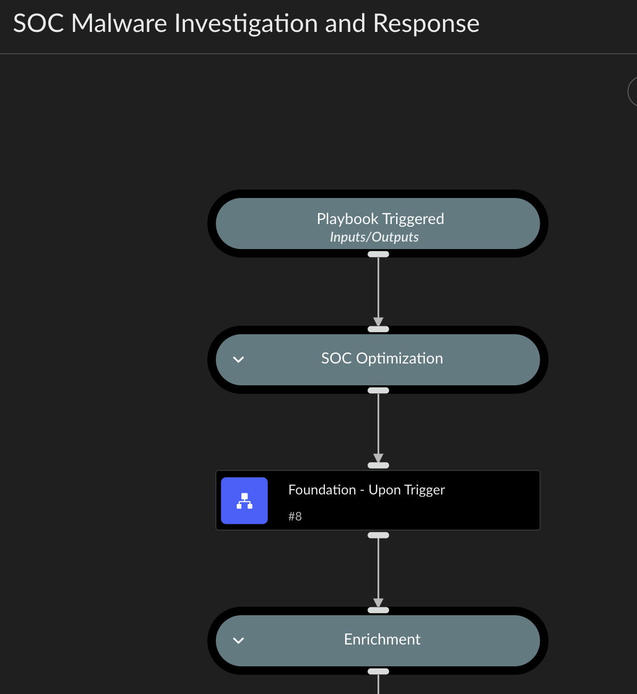
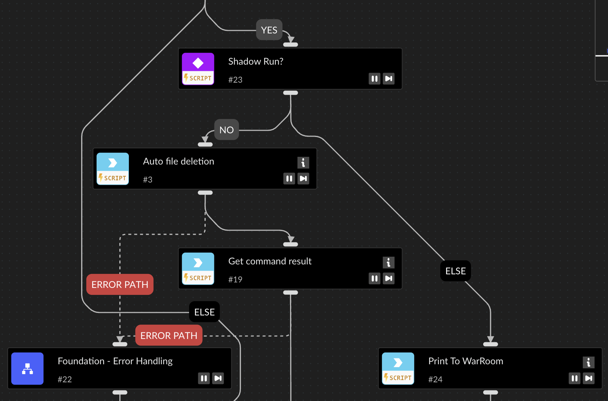
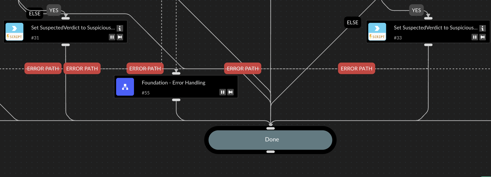

# SOC Phishing Investigation and Response Playbooks (XSIAM)

This repository contains Cortex XSIAM playbooks designed for phishing incident investigation and response in a Security Operations Center (SOC) environment. These playbooks are tailored to provide structured, repeatable, and safe workflows that align with SOC optimization principles.

## Overview

The playbooks in this repo:
- Leverage the [soc-optimization](https://github.com/Palo-Cortex/soc-optimization) framework.
- Begin with a standardized **"Upon Trigger"** playbook for consistent initial conditions.
- Include safety features such as **Shadow Mode** and **Error Handling**.

## Key Concepts

### 1. Upon Trigger Playbook

The first task of every parent playbook is to invoke the `Foundation - Upon Trigger` sub-playbook. This is a standardized routine imported from the `soc-optimization` framework.

#### Purpose
- Ensure a consistent playbook environment.
- Check for and set common incident fields.
- **Activate Shadow Mode**, which is crucial for safe testing and development.
- Establish context variables required for downstream tasks.

#### Shadow Mode
When Shadow Mode is enabled:
- All tasks that could modify external systems (e.g., disable user, move email to junk folder, remove message from inbox) are **skipped or simulated**.
- These tasks instead **print the intended action to the War Room**, allowing teams to validate logic before enabling in production.

#### Screenshot - Upon Trigger:

#### Screenshot - Shadow Mode Example:

---

### 2. Error Handling

All playbooks call a standard `Error Handler` sub-playbook to:
- Log task failures
- Print tracebacks to the War Room
- Flag incidents for manual review when critical automation fails

#### Screenshot - Error Handling:

---

## Requirements

- Cortex XSIAM v2.5+
- Dependencies outlined in the [soc-optimization](https://github.com/Palo-Cortex/soc-optimization) repo

---

## Dependency Graph

---

## Contributing

Contributions are welcome. Please open an issue or PR to propose changes or enhancements.
